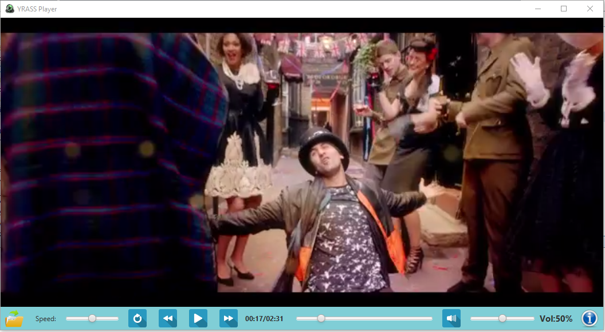

# OOMS-Project



## To run the player
``` 
Download the project folder, extact it or clone the project in your system
Double click the executable - student.jar file or open the project in netbeans ide and run
```

# Developers
* Arindam Das Modak
* Yashwardhan Gupta
* Rishab Agarwal
* Shiv Kumar
* Saurabh Mishra
